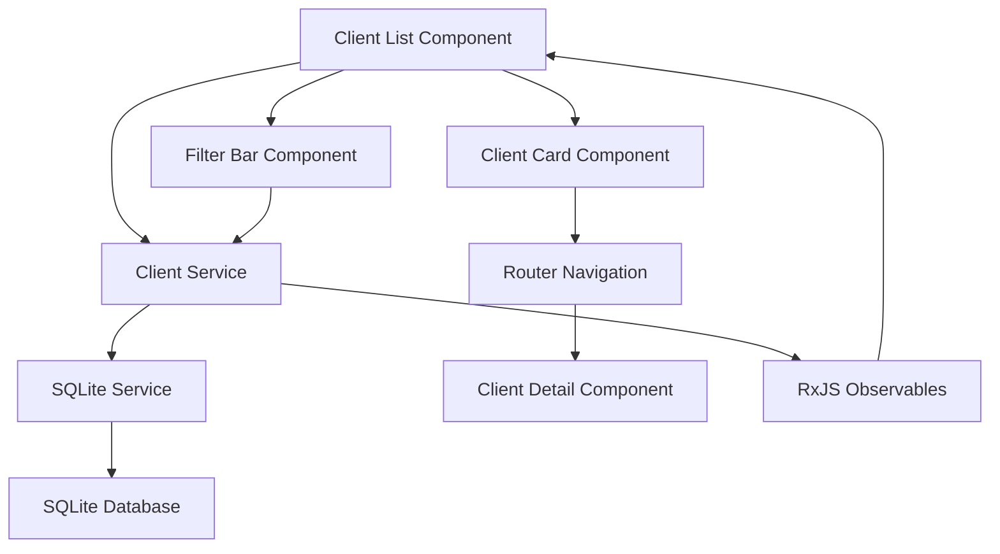
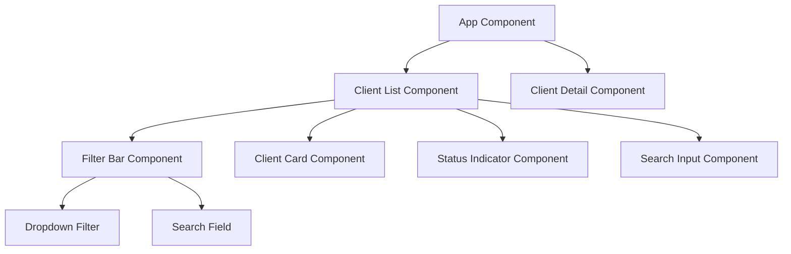
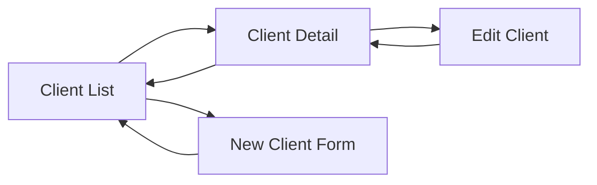

# Visual Identity Implementation - Client Management System

## Overview

This document outlines the implementation of a new visual identity system for a client management application built with Angular, SCSS, and SQLite. The system focuses on providing a clean, modern interface for managing client data with emphasis on visual clarity and user experience.

### Core Requirements
- **Frontend Framework**: Angular with TypeScript
- **styling**: SCSS for component styling and theming
- **Database**: SQLite for local data storage
- **Primary Feature**: Client list management with filtering and detailed views

## Technology Stack & Dependencies

### Core Technologies
- **Angular 16+**: Main frontend framework
- **TypeScript**: Primary programming language
- **SCSS**: Styling and theming system
- **SQLite**: Local database storage
- **RxJS**: Reactive programming for data flow

### Key Dependencies
```json
{
  "@angular/core": "^16.0.0",
  "@angular/common": "^16.0.0",
  "@angular/router": "^16.0.0",
  "@angular/forms": "^16.0.0",
  "better-sqlite3": "^8.7.0",
  "rxjs": "^7.8.0"
}
```

## Architecture

### Application Structure
```
src/
├── app/
│   ├── core/
│   │   ├── services/
│   │   │   ├── client.service.ts
│   │   │   └── sqlite.service.ts
│   │   └── models/
│   │       └── client.model.ts
│   ├── shared/
│   │   ├── components/
│   │   │   ├── filter-bar/
│   │   │   ├── status-indicator/
│   │   │   └── search-input/
│   │   └── pipes/
│   ├── features/
│   │   └── clients/
│   │       ├── client-list/
│   │       ├── client-card/
│   │       └── client-detail/
│   └── styles/
│       ├── _variables.scss
│       ├── _mixins.scss
│       └── _themes.scss
```

### Data Flow Architecture



## Component Architecture

### Component Hierarchy



### Core Components

#### ClientListComponent
**Purpose**: Main container for client management interface
**Properties**:
- `clients$: Observable<Client[]>` - Reactive client data stream
- `filteredClients$: Observable<Client[]>` - Filtered client results
- `viewMode: 'grid' | 'list'` - Display mode toggle
- `searchTerm: string` - Current search filter
- `statusFilter: ClientStatus` - Status filter selection

**Methods**:
- `toggleViewMode()` - Switch between grid and list views
- `onSearchChange(term: string)` - Handle search input changes
- `onStatusFilter(status: ClientStatus)` - Apply status filtering
- `navigateToClient(clientId: string)` - Navigate to client details

#### ClientCardComponent
**Purpose**: Individual client display component
**Properties**:
- `client: Client` - Client data input
- `viewMode: 'grid' | 'list'` - Display mode from parent

**Template Structure**:
```html
<div class="client-card" [class.grid-view]="viewMode === 'grid'">
  <div class="client-logo">
    
  </div>
  <div class="client-info">
    <h3>{{ client.name }}</h3>
    <div class="client-metrics">
      <span class="metric">{{ client.totalProjects }} projetos</span>
      <span class="metric">{{ client.totalRevenue | currency:'BRL' }}</span>
      <span class="metric">{{ client.totalHours }}h</span>
    </div>
    <app-status-indicator [status]="client.status"></app-status-indicator>
  </div>
</div>
```

#### FilterBarComponent
**Purpose**: Search and filtering controls
**Properties**:
- `searchTerm: string` - Current search term
- `selectedStatus: ClientStatus` - Selected status filter
- `statusOptions: ClientStatus[]` - Available status options

**Events**:
- `searchChange: EventEmitter<string>` - Search term changes
- `statusChange: EventEmitter<ClientStatus>` - Status filter changes

#### StatusIndicatorComponent
**Purpose**: Visual status representation
**Properties**:
- `status: ClientStatus` - Client status to display
- `showLabel: boolean` - Whether to show text label

**Status Mapping**:
- Ativo (Active): Verde (#1abc9c)
- Suspenso (Suspended): Cinza (#ccd6e1)
- Prospect: Azul (#5e2a96)

## Styling Strategy

### Design System Variables

```scss
// _variables.scss
// Color Palette
$primary-purple: #5e2a96;
$secondary-turquoise: #1abc9c;
$neutral-light: #f5f7fa;
$neutral-medium: #ccd6e1;
$neutral-dark: #4a5568;

// Status Colors
$status-active: #1abc9c;
$status-suspended: #ccd6e1;
$status-prospect: #5e2a96;

// Typography
$font-family-primary: 'Inter', 'Poppins', sans-serif;
$font-size-base: 16px;
$font-size-small: 14px;
$font-size-large: 18px;
$font-size-xl: 24px;

// Spacing
$spacing-xs: 4px;
$spacing-sm: 8px;
$spacing-md: 16px;
$spacing-lg: 24px;
$spacing-xl: 32px;

// Borders
$border-radius: 8px;
$border-width: 1px;
$border-color: $neutral-medium;

// Shadows
$shadow-light: 0 2px 4px rgba(0, 0, 0, 0.1);
$shadow-medium: 0 4px 8px rgba(0, 0, 0, 0.15);
```

### Component Styles

#### Client List Layout
```scss
.client-list-container {
  padding: $spacing-lg;
  background-color: $neutral-light;
  min-height: 100vh;

  .page-header {
    display: flex;
    justify-content: space-between;
    align-items: center;
    margin-bottom: $spacing-lg;

    h1 {
      color: $primary-purple;
      font-size: $font-size-xl;
      font-weight: 600;
    }

    .new-client-btn {
      background-color: $primary-purple;
      color: white;
      padding: $spacing-sm $spacing-md;
      border-radius: $border-radius;
      border: none;
      cursor: pointer;
      transition: all 0.3s ease;

      &:hover {
        background-color: darken($primary-purple, 10%);
        transform: translateY(-2px);
        box-shadow: $shadow-medium;
      }
    }
  }

  .view-toggle {
    display: flex;
    gap: $spacing-sm;
    margin-bottom: $spacing-md;

    button {
      padding: $spacing-sm;
      border: 1px solid $border-color;
      background: white;
      cursor: pointer;
      transition: all 0.2s ease;

      &.active {
        background-color: $primary-purple;
        color: white;
        border-color: $primary-purple;
      }
    }
  }
}
```

#### Client Card Styles
```scss
.client-card {
  background: white;
  border-radius: $border-radius;
  padding: $spacing-md;
  border: $border-width solid $border-color;
  cursor: pointer;
  transition: all 0.3s ease;
  margin-bottom: $spacing-md;

  &:hover {
    transform: translateY(-4px);
    box-shadow: $shadow-medium;
    border-color: $secondary-turquoise;
  }

  &.grid-view {
    display: flex;
    flex-direction: column;
    text-align: center;
    min-height: 200px;

    .client-logo {
      margin-bottom: $spacing-md;
      
      img {
        width: 60px;
        height: 60px;
        border-radius: 50%;
        object-fit: cover;
      }
    }
  }

  &.list-view {
    display: flex;
    align-items: center;
    gap: $spacing-md;

    .client-logo img {
      width: 40px;
      height: 40px;
      border-radius: 50%;
    }

    .client-info {
      flex: 1;
      display: flex;
      justify-content: space-between;
      align-items: center;
    }
  }

  .client-metrics {
    display: flex;
    gap: $spacing-md;
    margin: $spacing-sm 0;

    .metric {
      font-size: $font-size-small;
      color: $neutral-dark;
      padding: 2px 8px;
      background-color: $neutral-light;
      border-radius: 12px;
    }
  }
}
```

#### Status Indicator Styles
```scss
.status-indicator {
  display: inline-flex;
  align-items: center;
  gap: $spacing-xs;
  font-size: $font-size-small;

  .status-dot {
    width: 8px;
    height: 8px;
    border-radius: 50%;

    &.active {
      background-color: $status-active;
    }

    &.suspended {
      background-color: $status-suspended;
    }

    &.prospect {
      background-color: $status-prospect;
    }
  }

  .status-label {
    font-weight: 500;
    text-transform: capitalize;
  }
}
```

## State Management

### Client Service Architecture

```typescript
@Injectable({
  providedIn: 'root'
})
export class ClientService {
  private clientsSubject = new BehaviorSubject<Client[]>([]);
  public clients$ = this.clientsSubject.asObservable();

  constructor(private sqliteService: SqliteService) {
    this.loadClients();
  }

  async loadClients(): Promise<void> {
    const clients = await this.sqliteService.getClients();
    this.clientsSubject.next(clients);
  }

  filterClients(searchTerm: string, status?: ClientStatus): Observable<Client[]> {
    return this.clients$.pipe(
      map(clients => clients.filter(client => {
        const matchesSearch = client.name.toLowerCase().includes(searchTerm.toLowerCase());
        const matchesStatus = !status || client.status === status;
        return matchesSearch && matchesStatus;
      }))
    );
  }

  async createClient(client: Partial<Client>): Promise<Client> {
    const newClient = await this.sqliteService.insertClient(client);
    await this.loadClients();
    return newClient;
  }

  async updateClient(id: string, updates: Partial<Client>): Promise<Client> {
    const updatedClient = await this.sqliteService.updateClient(id, updates);
    await this.loadClients();
    return updatedClient;
  }
}
```

### Data Models

```typescript
export interface Client {
  id: string;
  name: string;
  logoUrl?: string;
  status: ClientStatus;
  totalProjects: number;
  totalRevenue: number;
  totalHours: number;
  createdAt: Date;
  updatedAt: Date;
}

export enum ClientStatus {
  ACTIVE = 'active',
  SUSPENDED = 'suspended',
  PROSPECT = 'prospect'
}

export interface ClientFilters {
  searchTerm: string;
  status?: ClientStatus;
  sortBy?: 'name' | 'revenue' | 'projects' | 'hours';
  sortDirection?: 'asc' | 'desc';
}
```

## Routing & Navigation

### Route Configuration

```typescript
const routes: Routes = [
  {
    path: '',
    redirectTo: '/clients',
    pathMatch: 'full'
  },
  {
    path: 'clients',
    component: ClientListComponent,
    title: 'Clientes'
  },
  {
    path: 'clients/:id',
    component: ClientDetailComponent,
    title: 'Detalhes do Cliente'
  },
  {
    path: 'clients/new',
    component: ClientFormComponent,
    title: 'Novo Cliente'
  }
];
```

### Navigation Flow



## API Integration Layer

### SQLite Service

```typescript
@Injectable({
  providedIn: 'root'
})
export class SqliteService {
  private db: Database;

  constructor() {
    this.initializeDatabase();
  }

  private initializeDatabase(): void {
    this.db = new Database('clients.db');
    
    // Create clients table
    this.db.exec(`
      CREATE TABLE IF NOT EXISTS clients (
        id TEXT PRIMARY KEY,
        name TEXT NOT NULL,
        logo_url TEXT,
        status TEXT NOT NULL,
        total_projects INTEGER DEFAULT 0,
        total_revenue REAL DEFAULT 0,
        total_hours INTEGER DEFAULT 0,
        created_at DATETIME DEFAULT CURRENT_TIMESTAMP,
        updated_at DATETIME DEFAULT CURRENT_TIMESTAMP
      )
    `);
  }

  async getClients(): Promise<Client[]> {
    const stmt = this.db.prepare('SELECT * FROM clients ORDER BY name');
    return stmt.all().map(this.mapDbToClient);
  }

  async getClientById(id: string): Promise<Client | null> {
    const stmt = this.db.prepare('SELECT * FROM clients WHERE id = ?');
    const result = stmt.get(id);
    return result ? this.mapDbToClient(result) : null;
  }

  async insertClient(client: Partial<Client>): Promise<Client> {
    const id = this.generateId();
    const stmt = this.db.prepare(`
      INSERT INTO clients (id, name, logo_url, status, total_projects, total_revenue, total_hours)
      VALUES (?, ?, ?, ?, ?, ?, ?)
    `);
    
    stmt.run(
      id,
      client.name,
      client.logoUrl || null,
      client.status || ClientStatus.PROSPECT,
      client.totalProjects || 0,
      client.totalRevenue || 0,
      client.totalHours || 0
    );

    return this.getClientById(id)!;
  }

  private mapDbToClient(row: any): Client {
    return {
      id: row.id,
      name: row.name,
      logoUrl: row.logo_url,
      status: row.status as ClientStatus,
      totalProjects: row.total_projects,
      totalRevenue: row.total_revenue,
      totalHours: row.total_hours,
      createdAt: new Date(row.created_at),
      updatedAt: new Date(row.updated_at)
    };
  }

  private generateId(): string {
    return Math.random().toString(36).substr(2, 9);
  }
}
```

## Testing Strategy

### Unit Testing Structure

```typescript
// client-list.component.spec.ts
describe('ClientListComponent', () => {
  let component: ClientListComponent;
  let fixture: ComponentFixture<ClientListComponent>;
  let clientService: jasmine.SpyObj<ClientService>;

  beforeEach(async () => {
    const spy = jasmine.createSpyObj('ClientService', ['loadClients', 'filterClients']);

    await TestBed.configureTestingModule({
      declarations: [ClientListComponent],
      providers: [
        { provide: ClientService, useValue: spy }
      ]
    }).compileComponents();

    fixture = TestBed.createComponent(ClientListComponent);
    component = fixture.componentInstance;
    clientService = TestBed.inject(ClientService) as jasmine.SpyObj<ClientService>;
  });

  it('should filter clients by search term', () => {
    const mockClients = [
      { id: '1', name: 'Empresa A', status: ClientStatus.ACTIVE },
      { id: '2', name: 'Empresa B', status: ClientStatus.PROSPECT }
    ];
    
    clientService.filterClients.and.returnValue(of(mockClients));
    
    component.onSearchChange('Empresa');
    
    expect(clientService.filterClients).toHaveBeenCalledWith('Empresa', undefined);
  });

  it('should toggle view mode', () => {
    expect(component.viewMode).toBe('grid');
    
    component.toggleViewMode();
    
    expect(component.viewMode).toBe('list');
  });
});
```

### Component Testing Focus Areas

1. **Client List Component**:
   - Search functionality
   - Status filtering
   - View mode switching
   - Navigation to client details

2. **Client Card Component**:
   - Data display accuracy
   - Status indicator rendering
   - Click navigation

3. **Filter Bar Component**:
   - Search input handling
   - Filter dropdown functionality
   - Event emission

4. **SQLite Service**:
   - Database operations
   - Data mapping
   - Error handling

### Testing Configuration

```typescript
// test-db.service.ts
export class TestDatabaseService extends SqliteService {
  constructor() {
    super();
    this.initializeTestDatabase();
  }

  private initializeTestDatabase(): void {
    // Use in-memory database for testing
    this.db = new Database(':memory:');
    this.initializeDatabase();
    this.seedTestData();
  }

  private seedTestData(): void {
    const testClients = [
      {
        name: 'Empresa Teste A',
        status: ClientStatus.ACTIVE,
        totalProjects: 5,
        totalRevenue: 15000,
        totalHours: 120
      },
      {
        name: 'Empresa Teste B', 
        status: ClientStatus.PROSPECT,
        totalProjects: 0,
        totalRevenue: 0,
        totalHours: 0
      }
    ];

    testClients.forEach(client => this.insertClient(client));
  }
}
```